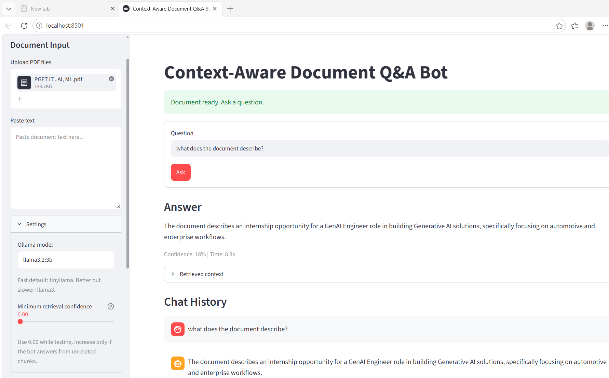
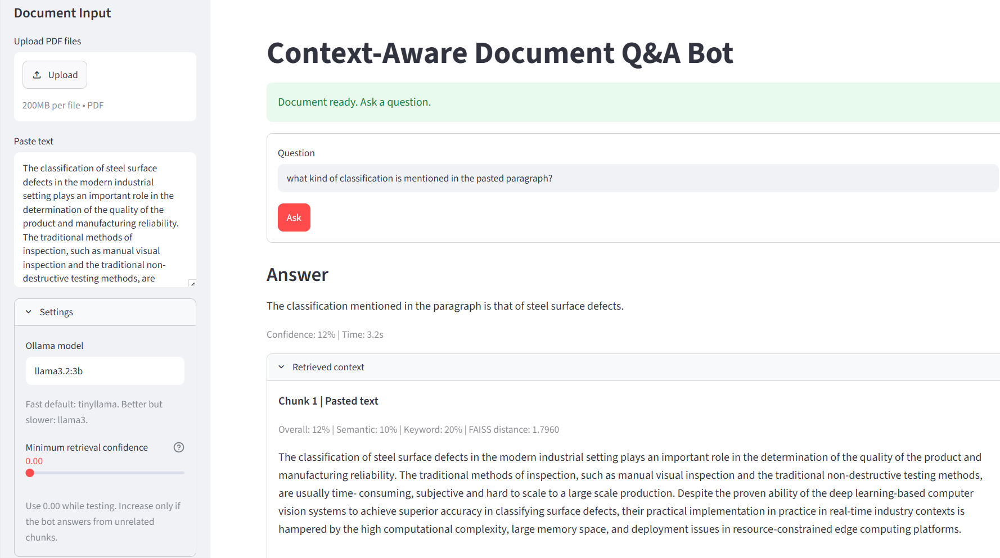
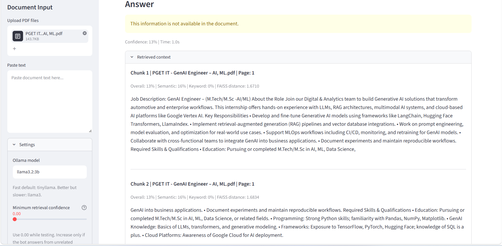
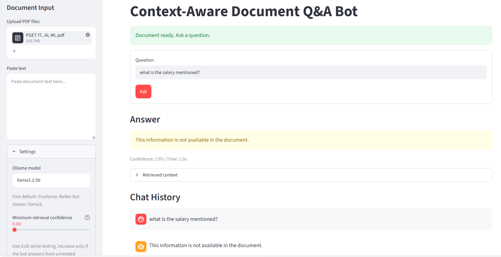

# 📄 Context-Aware Document Q&A Bot (RAG)

A **Retrieval-Augmented Generation (RAG)** application that answers questions exclusively from uploaded documents. The system combines **semantic search**, **vector retrieval**, and a **locally hosted Large Language Model (LLM)** to generate accurate, context-grounded responses while minimizing hallucinations.

Built using **Streamlit**, **LangChain**, **FAISS**, **Sentence Transformers**, and **Ollama**.

---

## 🚀 Features

- 📄 Upload PDF documents or paste raw text
- 🧹 Automatic text extraction and cleaning
- ✂️ Intelligent document chunking
- 🧠 Semantic embeddings using Sentence Transformers
- 🔍 Fast similarity search with FAISS Vector Store
- 🤖 Context-aware question answering using LangChain
- 🦙 Local inference with Ollama (Llama 3.2)
- 📊 Confidence score for generated responses
- 📑 Display retrieved source chunks
- 💬 Chat history support
- 🚫 Hallucination prevention by answering only from document context
- ⚡ Fully local execution without external API dependencies

---

# 🏗️ System Architecture

<p align="center">
  
</p>

The application follows a Retrieval-Augmented Generation (RAG) workflow:

1. User uploads a PDF or pastes text.
2. Document text is extracted and cleaned.
3. Text is split into semantic chunks.
4. Sentence Transformers generate embeddings.
5. Embeddings are indexed using FAISS.
6. User submits a question.
7. Top-K relevant chunks are retrieved.
8. LangChain combines retrieved context with the user query.
9. Ollama generates a context-grounded response.
10. The application displays the answer, confidence score, retrieved chunks, and chat history.

---

# 🖼️ Application Screenshots

## Home Interface

<p align="center">

</p>

---

## Query Using Pasted Text

<p align="center">

</p>

---

## Retrieved Context

<p align="center">

</p>

---

## Information Not Found Response

<p align="center">

</p>

The application returns the following response whenever the requested information is unavailable in the uploaded document:

```text
This information is not available in the document.
```

---

# 🎥 Project Demo

A complete walkthrough of the application is available below.

**Demo Video**

```
assets/demo.mp4
```

After cloning the repository, open the video locally for a complete demonstration.

---

# 🛠️ Tech Stack

| Category | Technologies |
|-----------|--------------|
| Programming Language | Python 3.11 |
| Web Framework | Streamlit |
| RAG Framework | LangChain |
| Vector Database | FAISS |
| Embedding Model | Sentence Transformers |
| LLM | Ollama (Llama 3.2) |
| PDF Processing | PyPDF2 |
| Machine Learning | Hugging Face Transformers |
| Testing | Pytest |
| CI/CD | GitHub Actions |

---

# 📁 Repository Structure

```
Context-Aware-Document-QA-Bot/
│
├── .github/
│   └── workflows/
│
├── .streamlit/
│
├── assets/
│   ├── Architecture.png
│   ├── demo.mp4
│   ├── document-upload-and-answer.png
│   ├── pasted-text-query.png
│   ├── retrieved-context.png
│   └── information-not-found-response.png
│
├── data/
├── scripts/
├── tests/
│
├── app.py
├── rag_pipeline.py
├── requirements.txt
├── requirements-dev.txt
├── pyproject.toml
├── LICENSE
├── README.md
└── .gitignore
```

---

# ⚙️ Installation

## Clone the Repository

```bash
git clone https://github.com/ponnarasan-v/azentrix-fullstack-task1.git

cd azentrix-fullstack-task1
```

---

## Create Virtual Environment

### Windows

```powershell
python -m venv .venv

.\.venv\Scripts\activate
```

### Linux/macOS

```bash
python -m venv .venv

source .venv/bin/activate
```

---

## Install Dependencies

```bash
pip install --upgrade pip

pip install -r requirements.txt
```

---

# 🦙 Ollama Setup

Verify installed models

```bash
ollama list
```

Pull the recommended model

```bash
ollama pull llama3.2:3b
```

Start Ollama

```bash
ollama serve
```

---

# ▶️ Run the Application

```bash
streamlit run app.py
```

Open your browser and visit

```
http://localhost:8501
```

---

# 💡 How to Use

1. Launch the application.
2. Upload a PDF or paste text.
3. Click **Process Document**.
4. Enter your question.
5. Review the generated response.
6. Inspect the retrieved context and confidence score.

---

# 🤖 Recommended Models

| Model | Description |
|--------|-------------|
| llama3.2:3b | Recommended balance between speed and accuracy |
| tinyllama | Lightweight model for quick testing |
| mistral | Better reasoning capability |
| llama3 | Higher-quality responses with larger resource requirements |

> **Note:** Embedding models such as `nomic-embed-text` should only be used for generating embeddings and not as chat models.

---

# ✅ Testing

Install development dependencies

```bash
pip install -r requirements-dev.txt
```

Run all tests

```bash
pytest
```

---

# 🚀 Continuous Integration

GitHub Actions automatically performs:

- Dependency installation
- Code quality checks
- Unit testing
- Build verification

for every push and pull request.

---

# 📌 Example Use Cases

- Enterprise document search
- Internal knowledge assistants
- Research paper question answering
- Technical documentation assistant
- Policy and compliance document retrieval
- Educational learning assistant
- Local RAG experimentation

---

# 🔮 Future Enhancements

- Multi-document retrieval
- OCR support for scanned PDFs
- Hybrid keyword + semantic search
- Conversation memory
- Source citation highlighting
- Docker deployment
- Cloud deployment
- Multi-user authentication

---

# 📄 License

This project is licensed under the **MIT License**.

---

# 👨‍💻 Author

**Ponnarasan V**

M.Tech in Computer Science & Engineering (AI & ML)

**Areas of Interest**

- Generative AI
- Retrieval-Augmented Generation (RAG)
- Large Language Models
- Machine Learning
- Deep Learning
- Computer Vision

---
